# Datové struktury na externích paměťových médiích

## Úvod

Externí paměťová média (např. pevné disky) pracují pomaleji než vnitřní operační paměť, ale poskytují větší kapacitu. Proto se zde data organizují **blokově** – čte se celý blok naráz, ne po jednotlivých záznamech.

### Základní pojmy:

* **Blok**: jednotka přenosu mezi diskem a pamětí (např. 512 bajtů, 4 KB…).
* **Buffer**: oblast v paměti, kam se načítají/ukládají bloky.
* **Seek**: operace, kdy se hlavička disku fyzicky přesune – časově náročné.

---

## Typy souborů

### 1. **Sekvenční soubor**

* Záznamy jsou **uloženy za sebou** v libovolném pořadí, posledním záznamem je **eof** (end of file)
* Přístup pouze **sekvenční** (čtení jeden po druhém).
* Efektivní pro **průchod všemi daty**, např. výpis všech záznamů.


* Bloky mohou být alokovány:
  * v **souvislé oblasti** (možné na pásce i na disku)
  * v **nesouvislé oblasti**, kdy jsou bloky zřetězené pomocí adres (možné na disku)

* Záznamy nemusí mít definovanou klíčovou položku (nedá se tedy využít pro přístup)

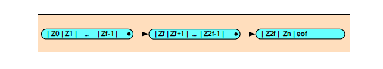

**Operace:**

* `Najdi`: čti bloky postupně, dokud nenajdeš klíč nebo nedojdeš na konec.
* `Vlož`: často nutná **rekonstrukce** celého souboru.
* `Odeber`: záznam se **označí jako neplatný** (např. příznakem).


#### Anticipované čtení
Ze sekvenčního souboru lze číst pouze následující záznam, vzhledem k aktuálnímu záznamu, a proto je výhodné po zpracování posledního záznamu z bufferu **automaticky zahájit přenos dalšího bloku**

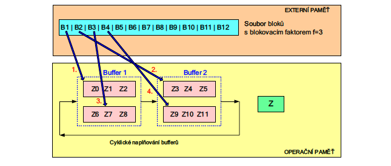

#### Komulovaný zápis
Podobně jako u předběžného čtení: blok dat se ukládá do souboru teprve tehdy, když se paměťový buffer naplní. Mezitím už se do dalšího bufferu zapisují nová data.

#### Závěr
Sekvenční přístup poskytuje nejrychlejší zpracování v případě, že je potřebné zpracovat všechny záznamy v souboru. Lze jej tedy rovněž používat i u souborů, u nichž je implementovaný i přímý přístup (podle klíče), který bude probírán v dalších tématech.


---

### 2. **Soubor s přímým přístupem**


####  Základní princip:

* Data jsou uložena na **disku** ve **formě bloků stejné velikosti** (např. B₀, B₁, B₂...).
* **Přímý přístup** znamená, že záznam můžeme najít **okamžitě podle klíče nebo indexu** – nemusíme projít celý soubor.
* Každý záznam má **adresu**: číslo bloku a pozici uvnitř bloku.


####  **Operace**

#### Podle klíče:

* `Čti(S,Z,K)` – načte záznam s klíčem `K` do pracovní oblasti `Z`
* `Zapiš(S,Z)` – uloží záznam z `Z` do souboru `S`
* `Zruš(S,K)` – smaže záznam s klíčem `K` v souboru `S`
* `Modifikuj(S,Z,K)` – upraví záznam s klíčem `K` podle dat v `Z`

#### Podle indexu:

* `Čti(S,Z,i)` – načte záznam s indexem `i`
* `Zruš(S,i)` – smaže záznam s indexem `i`

#### Základní blokové operace:

* `ČtiBlok(S, Buff, i)` – načte i-tý blok z disku do paměti
* `ZapišBlok(S, Buff, i)` – uloží blok z paměti zpět na disk


####  **Efektivita**

* Hlavní metrika je **počet blokových přenosů** mezi diskem a operační pamětí.
* Každý přenos je **časově náročný** – stojí asi jako milion vnitřních operací.


####  **Technické poznámky**

* **Řídicí blok B₀** obsahuje metadata o souboru (např. počet bloků).
* **Soubory s nefixovanými záznamy** – záznamy se mohou přesouvat.
* **Soubory s fixovanými záznamy** – záznamy se nepřesouvají, přístup je buď na jednotlivé záznamy, nebo celé bloky.


####  **Přidělování bloků na disku**

* Alokuje se **po blocích**, ne po bajtech.
* Existují dva přístupy:

  * **Dynamický** – bloky se přidělují za běhu (`PřidělNovýBlok`, `VraťBlok`)
  * **Statický** – bloky jsou předem rezervované, spravuje se „zásoba“ prázdných bloků

---

### 2.1 **Neutříděný soubor s přímým přístupem (heap file)**

* Je to **tabulka uložená na disku bez jakéhokoliv třídění**.
* Hledání záznamu je **neefektivní**, protože musíme často prohledat větší část souboru.
* Záznamy jsou **uloženy v libovolném pořadí**, bez ohledu na hodnoty klíčů.


#### Organizace:

* Používá **statický přístup** pro přidělování bloků (bloky jsou předem připravené).
* Záznamy jsou rozděleny do **bloků**, které mají pevnou velikost.


#### Zpracování

#### 1. **Přímý přístup**

* **Podle klíče**: `ČtiHeap(S,Z,K)` – pokusí se najít záznam s klíčem `K` a načte ho do pracovní oblasti `Z`.
* **Podle indexu (pořadí)**: `ČtiHeap(S,Z,i)` – načte i-tý záznam.

##### Další operace:

* `ZapišHeap(S,Z)` – uloží záznam z pracovní oblasti.
* `ZrušHeap(S,K)` – smaže záznam s klíčem `K`.
* `ModifikujHeap(S,Z,K)` – nahradí záznam s klíčem `K` novým obsahem z `Z`.

##### Organizační operace:

* `VytvořHeap(S)`, `OtevřiHeap(S)`, `ZavřiHeap(S)` – správa souboru.

#### 2. **Sekvenční přístup**

* Prochází záznamy postupně:

  * `OtevřiHeapSeq(S)`
  * `ČtiHeapSeq(S,Z)`
  * `ZavřiHeapSeq(S)`


#### Řídicí blok (B₀)

* Obsahuje informace o souboru:

  * Kolik je bloků, kde je aktuální blok/záznam, jaká je první volná pozice atd.
* Pomáhá řídit čtení a zápis v souboru.

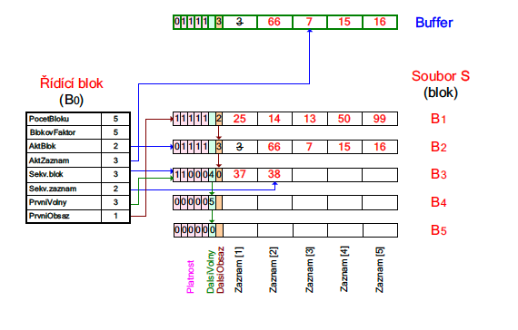


#### Poznámky

* **Nevýhoda**: Hledání podle klíče může znamenat **prohledání všech bloků** (v průměru půlka souboru).
* **Možnost fixace záznamů**: Můžeme použít, pokud nechceme měnit jejich pořadí.
* **Vhodné pro malé soubory**, nebo jako dočasné úložiště v komplexnějších systémech.

---

### 3. **Hashovací soubor**

* **Neutříděný soubor**, kde se pro přístup podle klíče používá **hashovací funkce**.
* Hashovací funkce převede klíč na **adresu bloku**, kde se záznam nachází (pokud existuje).
* V bloku jsou data uložena **sériově** (tj. bez třídění).

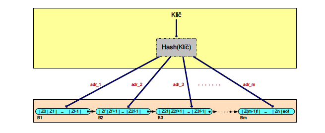

#### Základní princip

* Místo mapování klíč → záznam se provádí:

  ```
  klíč → hash → adresa bloku → (blok obsahuje záznam)
  ```
* Hash funkce počítá adresu např. jako:

  ```
  adresa bloku = (logická adresa záznamu) / velikost bloku + 1
  ```
* Pokud je blok plný, dochází ke **kolizím** (více klíčů se mapuje na stejný blok).

#### Přístupy

* **Přímý přístup podle klíče** – hashování určuje adresu bloku.
* **Sekvenční přístup** – používá se jen pokud jsou bloky řetězené.

#### Řešení kolizí

1. **Otevřené adresování**

   * Hledá se nejbližší volné místo (sekvenčně).
   * Po smazání se místo označí speciální značkou.
   * Nevýhoda: může docházet ke **shlukování** (clustering).
   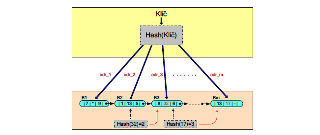

2. **Oblasti přeplnění bloků**

   * Pro každý přetížený blok se alokuje nový „přidružený“ blok.
   * Vzniká skupina bloků, které patří k jednomu hashovanému místu.
   * Účinné, ale méně paměťově efektivní.
   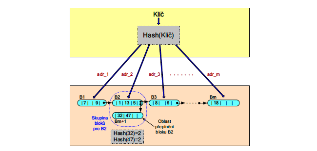

3. **Oblasti přeplnění souboru**

   * Jeden velký „přepínací“ soubor slouží pro všechny kolize.
   * Doporučuje se, aby byl celý v operační paměti.
   * Vysoká efektivita při čtení, pokud není moc kolizí.
   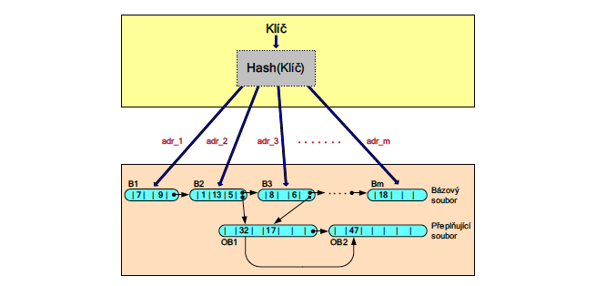


#### Závěr

* **Výhody**:

  * Při dobrém návrhu (dobrá hash funkce, řízení kolizí) je hashovací soubor **nejefektivnější metodou** přístupu podle klíče.
  * Lze použít **fixované záznamy** (nemění pozici).

* **Nevýhody**:

  * Vyžaduje **dobrou znalost vlastností klíčů**.
  * Pokud se struktura příliš zaplní kolizemi, je **těžké ji reorganizovat**.
  * **Nevhodné pro aplikace s častými změnami dat** (vkládání, mazání, přepis).

---


### 4. **Souvislý utříděný soubor**

#### Základní charakteristiky

* Záznamy jsou **seřazeny podle klíče** nejen v rámci bloků, ale i napříč celým souborem.
* U každého bloku platí:
  klíče v bloku `Bₓ` jsou menší než klíče v bloku `Bₓ₊₁`.
* Vkládání (`Zapiš`) nebo mazání (`Zruš`) může způsobit nutnost **přečtení a reorganizace** více bloků, zejména pokud je potřeba záznamy přesouvat.
* Obvykle se bloky plní jen do určité míry (např. 80 %), aby se předešlo častému přesunu dat.

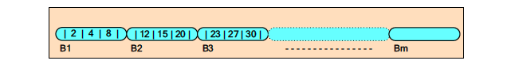

#### Způsob zpracování

* **Sekvenční** – např. čtení všech záznamů podle klíčů.
* **Přímý přístup podle klíče** – např. pomocí vyhledávacích metod:


#### **Koncepce vyhledávání**

#### a) **Modifikované binární vyhledávání**

* Načte se prostřední blok a hledá se, zda obsahuje hledaný klíč `K`.
* Pokud klíč není nalezen a není vyloučeno, že může být "vpravo", čte se další blok a hledání se opakuje.
* Vhodné pro **malé soubory**, ale složitost O(log *m*) pro **velké soubory nestačí**.


#### b) **Modifikované interpolační vyhledávání**

* Funguje dobře, pokud jsou klíče **rovnoměrně rozložené**.
* Odhaduje, kde by se měl nacházet hledaný klíč, a načte se blok na základě výpočtu:

  ```
  d = (K - K_B1) / (K_BR - K_B1)
  M = L + (R - L + 1) * d
  ```
* Rychlejší než binární hledání:

  * Střední složitost: **O(log log m)**
  * Nejhorší případ: **O(m)** (pokud je rozložení nerovnoměrné)

#### Omezení

* **Není podporováno fixování záznamů**, protože se záznamy kvůli třídění často přesouvají.

---

### 5. Indexsekvenční soubor

#### Základní charakteristiky

* Skládá se ze **dvou souborů**:
  * **Index** – obsahuje:

    * **Adresu** bloku v bázovém souboru
    * **Nejmenší klíč**, který je v daném bloku
  * **Bázový soubor** – utříděný soubor (záznamy podle klíče, může mít zřetězené bloky)
 

* Index umožňuje rychlé nalezení bloku, kde by se mohl záznam nacházet.

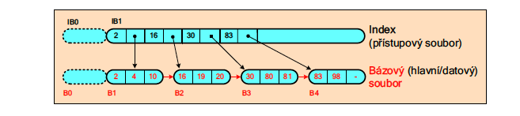

* **Zpracování** může být:

  * **Sekvenční** (v pořadí klíčů)
  * **Přímé** (vyhledání podle klíče přes index)


#### Přímé zpracování

#### Vyhledávání (`Čti(S,K)`)

1. Vyhledání v indexu, který klíč `K` pokrývá (binární/interpolační hledání)
2. Načtení odpovídajícího bloku z bázového souboru


#### Vkládání (`Zapiš(S,Z)`)

1. Najde se správný blok podle indexu
2. Pokud je v bloku místo, vloží se tam
3. Pokud **není místo**:

   * Buď se přesunou záznamy do jiného bloku
   * Nebo se alokuje **nový blok**
   * Aktualizuje se index (např. nový záznam pokrývá jiný rozsah klíčů)


#### Mazání (`Zruš(S,K)`)

1. Najde se blok obsahující záznam
2. Záznam se označí jako neplatný (např. boolean příznak)
3. Pokud je blok celý prázdný → může být **dealokován** a z indexu se odstraní

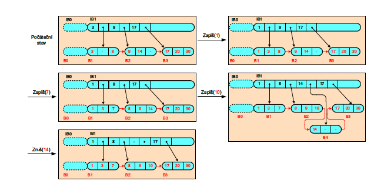


#### Závěrečné poznámky

* Umožňuje rychlé vyhledávání pomocí **modifikovaného binárního** nebo **interpolačního vyhledávání**.
* **Nevýhoda**: Při častém vkládání může docházet k **přesunům mezi bloky** (náročné).
* **Není podporováno fixování záznamů**.
* Výhodou je **snadná reorganizace** (nový indexový soubor na základě starého).
* **Podporuje sekvenční zpracování**.

---

### 6. **B⁺-strom**

#### Základní charakteristiky

* **B⁺-strom** je **rozšířením indexsekvenčního souboru**:

  * Místo jednoduchého indexu se používá **víceúrovňová (hierarchická)** struktura – **B-strom**.

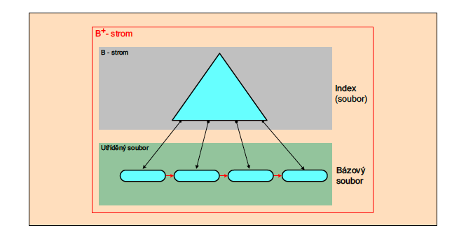

* **Indexová část (B-strom)**:

  * Obsahuje pouze **klíče** a **adresy bloků** v bázovém souboru (listy stromu).
  * Vnitřní uzly slouží pouze k navigaci – **data jsou jen v listech**.

* **Bázový (utříděný) soubor**:

  * Obsahuje kompletní záznamy.
  * Všechny listy B⁺-stromu jsou **zřetězeny** pro snadný sekvenční průchod.

#### Výhody:

* Efektivní **přímý přístup podle klíče** – prohledáváním stromu od kořene k listu.
* Efektivní **sekvenční průchod** – listy jsou spojeny jako spojový seznam.
* Vhodné pro **velké databáze** – vyvážená vícestupňová struktura snižuje počet diskových přístupů.


#### Přístupy:

* **Přímý přístup**: podle klíče → prohledáním stromu.
* **Sekvenční přístup**: průchod listy ve stromu (např. intervalové dotazy).


#### Struktura (viz obrázky):

* Horní část: **stromová indexová struktura** (kořen, vnitřní uzly, listy).
* Dolní část: **fyzická struktura souboru** – listy (např. bloky B1 až B7) jsou lineárně uspořádány a obsahují skutečná data.
* **Každý list ukazuje na další** → podpora rychlého sekvenčního průchodu.

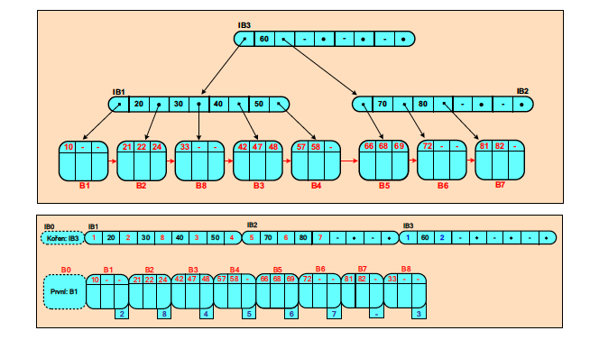

---

### 7. **Soubor s úplným (hustým) indexem**

* Dřívější typy indexů byly **řídké** – odkazovaly na celé bloky.
  * Indexsekvenční soubor
  * Hashovací soubor
* **Úplný (hustý) index** má **záznam pro každý jednotlivý záznam** v bázovém souboru.
* Bázový soubor **nemusí být utříděný**, což usnadňuje práci s dynamickými daty.
* Díky tomu lze bez problému **fixovat záznamy** (nemusí se přesouvat).


#### Organizace

* Používá se:

  * **B⁺-strom jako úplný index**, kde každý záznam obsahuje **klíč + adresu záznamu**.
  * **Neutříděný bázový soubor (heap file)** – obsahuje samotná data.

  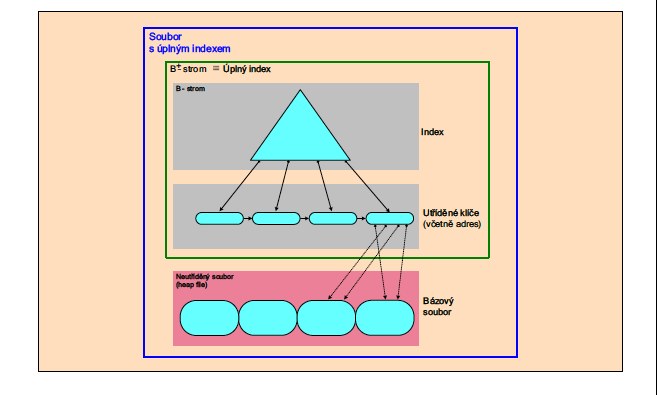


#### Zpracování

* **Přímý přístup podle klíče** – přes B⁺-strom.
* **Sekvenční přístup** – projíždění záznamů v pořadí klíčů.
* Případně **přístup podle pořadí bloků-listů** (zřetězené bloky).

  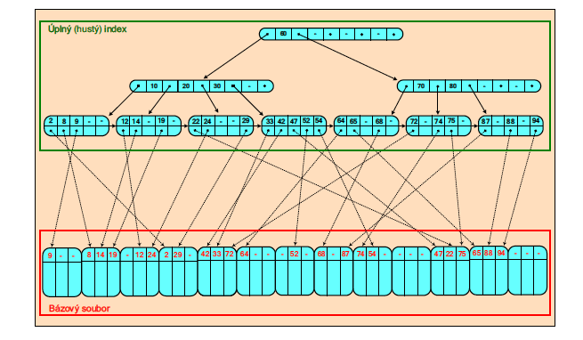

#### Operace

* **Najdi / Čti(K)**
  Najde se klíč `K` v B⁺-stromu → přes adresa se načte příslušný záznam z bázového souboru.

* **Zapiš(K, Z)**
  Vloží se záznam s klíčem `K` na volné místo v heap souboru → do indexu se uloží odkaz (klíč + adresa).

* **Zruš(K)**
  Označí se záznam jako neplatný a smaže se i z indexu.

> Pozn.: Operace v B⁺-stromu mohou způsobit **reorganizaci indexu**, ale ne samotného bázového souboru.

#### Shrnutí vlastností

* **Bázový soubor je neutříděný**, a proto není třeba přesouvat záznamy.
* Lze bez problému **fixovat záznamy**.
* Lze vytvořit **více úplných indexů** nad jedním bázovým souborem (např. podle různých klíčů).

---

Tady je odpověď na otázku:

---

### **Charakterizace řídkého, hierarchicky uspořádaného indexového souboru:**

**Řídký, hierarchicky uspořádaný indexový soubor** je:

> **Indexová struktura**, která neobsahuje záznam pro každý jednotlivý záznam bázového souboru (je tedy **řídká**), a zároveň je organizována do **více úrovní (hierarchicky)** – typicky ve formě **B-stromu nebo B⁺-stromu**, který umožňuje efektivní vyhledávání.


#### Klíčové charakteristiky:

* **Řídkost**: každý záznam indexu ukazuje na **blok (nebo skupinu)** záznamů, ne na každý jednotlivý záznam.
* **Hierarchie**: index není jednorozměrné pole, ale je tvořen **stromovou strukturou** – např. **B⁺-stromem**.
* **Účel**: zrychlení přímého přístupu ke záznamům v bázovém (utříděném) souboru.
* **Výhoda**: vyhledávání má složitost **O(log n)**, a je mnohem efektivnější než lineární nebo sekvenční přístup.
* **Použití**: např. v **indexsekvenčním souboru** s vícestupňovým indexem nebo při použití **řídkého B⁺-stromu**.


#### Příklad:

* **Indexsekvenční soubor** s velkým množstvím dat může mít:

  * 1. úroveň: hlavní index (kořen)
  * 2. úroveň: bloky indexu (listy)
  * 3. úroveň: ukazatele na bloky bázového souboru

Tak vzniká **řídký hierarchický index**, kde každý listový uzel indexu pokrývá více záznamů.


