# Haldy (Heaps)

## Co je halda a kde se používá?

Halda je stromová datová struktura, která podporuje rychlé přidávání prvků a výběr prvku s nejvyšší (nebo nejnižší) prioritou. Nejčastěji se používá pro **implementaci prioritní fronty** – tedy struktury, kde má každý prvek přiřazenou prioritu, a vybírají se prvky s nejvyšší prioritou.

### Typické aplikace:

* Plánování úloh
* Dijkstrův algoritmus (nejkratší cesty)
* Řízení událostí ve simulacích
* Řazení pomocí heapsortu

---

## Implementační možnosti Prioritní fronty

### Prioritní fronta nad lineárním seznamem

| Typ seznamu    | Vložení (`Vlož`) | Odebrání maxima (`OdeberMax`) |
| -------------- | ---------------- | ----------------------------- |
| **Utříděný**   | O(n)             | O(1)                          |
| **Neutříděný** | O(1)             | O(n)                          |

* Utříděný seznam → vkládání je pomalé (musí se najít správné místo), ale odebrání maxima je rychlé (na konci).
* Neutříděný seznam → vkládání rychlé (na konec), ale hledání maxima pomalé.

---

### Dvojseznamová prioritní fronta

* U-seznam (krátký, **utříděný**): pro **časté hledání a mazání**.
* N-seznam (dlouhý, **neutříděný**): pro **časté vkládání**.

| Operace         | Časová složitost |
| --------------- | ---------------- |
| Vložení         | O(√n)            |
| Odebrání maxima | O(√n)            |

* U-seznam má max. délku `M = √n`
* Princip: většinu operací děláme nad malým uspořádaným U-seznamem → zrychlení

---

### Dvojúrovňová prioritní fronta

* Kombinuje **utříděný seznam** (základ) a **indexové pole** (přístupová struktura)
* Rozděluje frontu na podsoubory délky `M = √n`

| Operace         | Časová složitost |
| --------------- | ---------------- |
| Vložení         | O(√n)            |
| Odebrání maxima | O(√n)            |

* Výhoda: při správném zvolení indexu dosahuje podobného výkonu jako binární halda

---

### Prioritní fronta na haldě

#### Binární halda (např. v poli):

* Každý uzel má max. 2 potomky.
* Vždy zachovává vlastnost „rodič má vyšší prioritu než děti“.

| Operace         | Časová složitost |
| --------------- | ---------------- |
| Vložení         | O(log n)         |
| Odebrání maxima | O(log n)         |

#### Implicitní reprezentace v poli:

* Pro prvek na indexu `i`:

  * levý syn: `2i`
  * pravý syn: `2i + 1`
  * rodič: `i div 2`

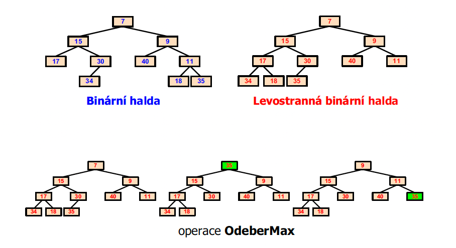
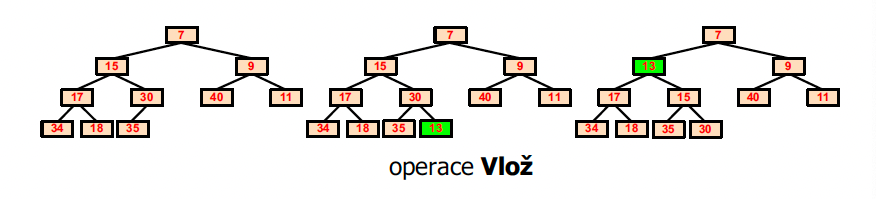
---

### Shrnutí

| Implementace                 | Vložení  | Odebrání Max |
| ---------------------------- | -------- | ------------ |
| Lineární seznam (utříděný)   | O(n)     | O(1)         |
| Lineární seznam (neutříděný) | O(1)     | O(n)         |
| Dvojseznamová fronta         | O(√n)    | O(√n)        |
| Dvojúrovňová fronta          | O(√n)    | O(√n)        |
| Binární halda                | O(log n) | O(log n)     |

---

## Binomická halda

### Princip:

**Binomický strom** (značíme $B_n$)

* Speciální typ uspořádaného stromu
* Má **řád $n$** a obsahuje přesně $2^n$ vrcholů.
* Je definován **rekurzivně**:

  * Kořen má $n$ synů.
  * Jeho $i$-tý syn je kořenem binomického stromu řádu $i$ (pro $i = 0, 1, ..., n-1$).
* **i-tý syn kořene** je podstrom řádu $B_i$ (seřazeno zprava doleva jako $B_{n-1}, ..., B_0$).
* **Výška stromu** je $n$.
* Na každé úrovni $i$ je přesně $\binom{n}{i}$ uzlů (podle binomického rozdělení – odtud název).

#### Jednoduše:

Je to **speciální typ stromu**, který má pravidelnou strukturu.

#### Pro každé číslo $n$ existuje strom $B_n$:

* Má **přesně $2^n$ uzlů**
* Má **výšku $n$** (tedy $n$ úrovní)
* Kořen má **$n$ dětí**, a každé dítě je **menší binomický strom**.

---

#### Jak vypadá:

* $B_0$ – jen jeden uzel
* $B_1$ – kořen + jeden potomek
* $B_2$ – kořen má 2 děti: jeden $B_1$, druhý $B_0$
* $B_3$ – kořen má 3 děti: $B_2$, $B_1$, $B_0$

---

#### Hlavní myšlenka:

Binomický strom **se staví skládáním menších stromů dohromady**, jako když se sčítájí binární čísla.

---

**Binomická halda** je **les binomických stromů**, kde každý strom má specifickou strukturu a velikost jako mocniny dvou.

Například halda může mít stromy velikosti: 1, 2, 4, 8, ...
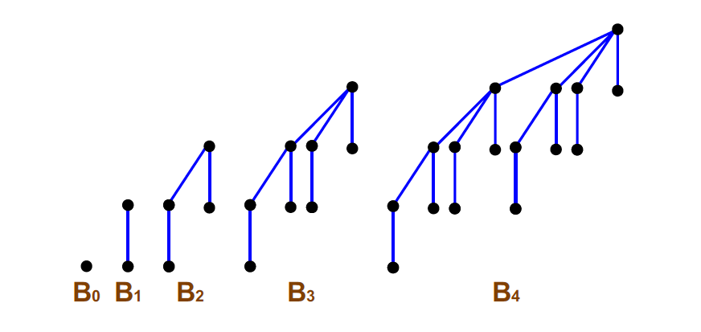
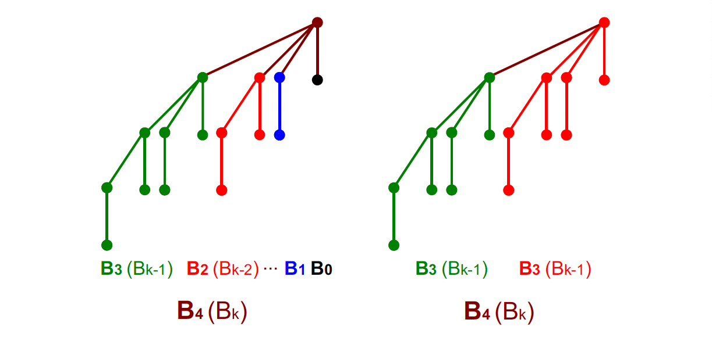
### Vlastnosti:

* Umožňuje efektivní spojování dvou hald.
* Každý strom v haldě má kořen s menší prioritou než jeho potomci.
* Stromy jsou udržovány seřazené podle velikosti.

### Operace:

####  `Sjednocení` – O(log n)

* **Co dělá:** Sloučí dva tzv. binomické lesy (L₁ a L₂), což jsou seznamy binomických stromů seřazené podle jejich řádu.
* **Pomocné operace:**
  **`Řád(K)`** - Identifikace řádu binomického stromu s kořenem **K** -> $B_k$
  **`Link(k1, k2)`** - Spojí dva binomické stromy stejného řádu (např. $B_2$) do jednoho většího
  * Vybere se ten s vyšší prioritou jako nový kořen.
  * Druhý strom se stane jeho podstromem (potomkem).
  * Tím vznikne nový binomický strom vyššího řádu.

  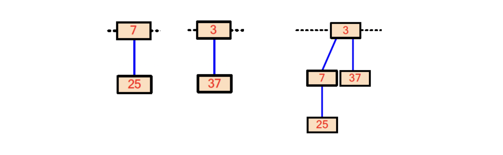

* **Jak:**

  1. Porovnává se řád (stupeň) prvních stromů v obou lesích.
  2. Vždy se vezme strom s menším řádem a vloží se do výsledného lesa L.
  3. Pokud mají stromy stejný řád, spojí se pomocí Link() a výsledek se zpracuje dál.
  4. Výsledkem je seřazený binomický les, který může obsahovat i dvojice stejných řádů (to se řeší dál při sjednocení hald).

  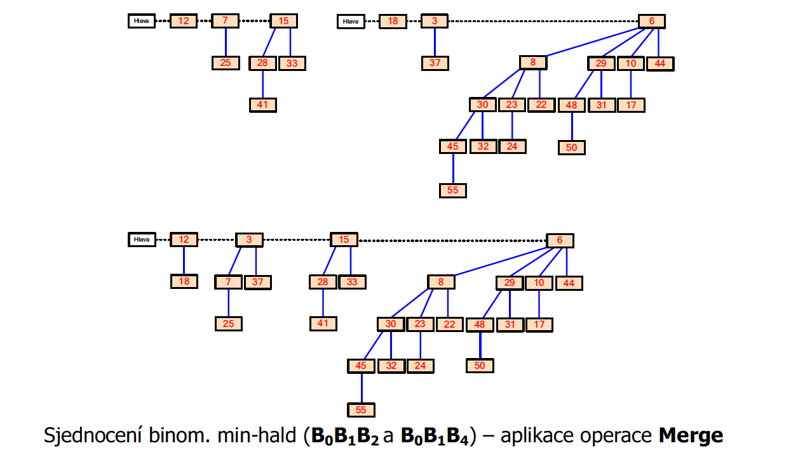

  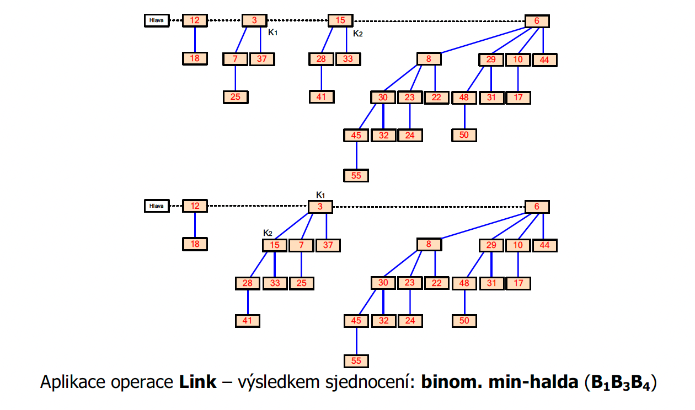

---

####  `Vlož(↓Prvek)` – O(log n)

* **Co dělá:** Přidá nový prvek do haldy.
* **Jak:**

  1. Vytvoří se nový malý binomický strom $B_0$ (jen s tímto prvkem).
  2. Ten se **sloučí (sjednotí)** s existující haldou, do níž se má **Prvek** vložit.

---

#### `OdeberMax(↑Prvek)` – O(log n)

* **Co dělá:** Odebere prvek s **nejvyšší prioritou**.
* **Jak:**

  1. Najde **prvek s nějvětší prioritou** mezi kořeny binomických stromů.
  2. Odebere tento kořen.
  3. Všechny jeho potomky (jsou to menší binomické stromy) vytvoří novou haldu.
  4. Tato nová halda se sloučí se zbytkem původní (**H** + **H'**).

  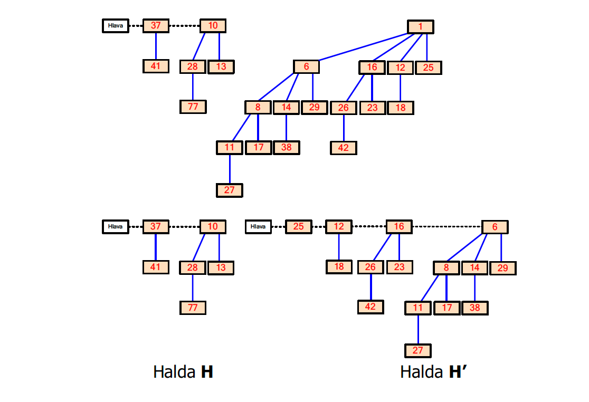
 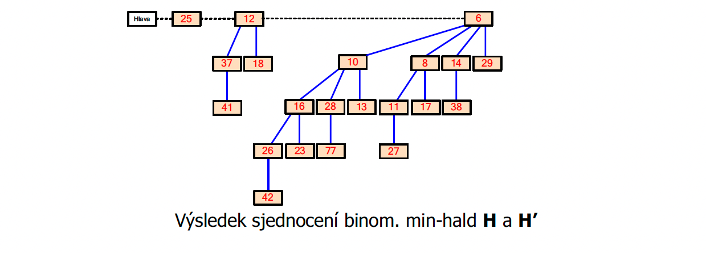

---

#### `ZvyšPrioritu(↓Prvek, ↓NováPriorita)` – O(log n)

* **Co dělá:** Zvýší prioritu daného prvku.
* **Jak:**

  1. Změní hodnotu prvku.
  2. Pak ho **vyměňuje s rodičem**, dokud je výše než rodič (aby zůstala halda správně uspořádaná).

  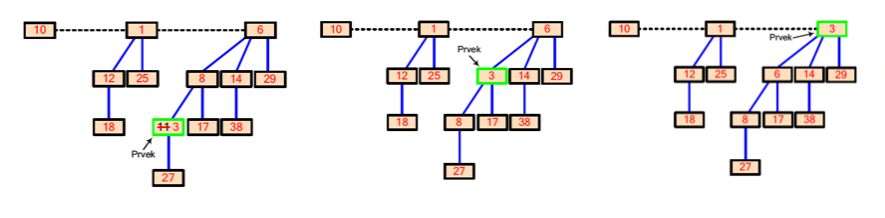

---

#### `Odeber(↓Prvek)` – O(log n)

* **Co dělá:** Odebere **libovolný prvek** z haldy.
* **Jak:**

  1. Nejprve pomocí `ZvyšPrioritu(prvek, ∞)` ho přemístí na vrchol (udělá z něj Max).
  2. Pak provede `OdeberMax()`.

---

## Fibonacciho halda

### Princip:

Představuje (podobně jako binomická halda) les haldově uspořádaných stromů (obvykle min-hald), s tím rozdílem že:
* **Nejsou** binomickými stromy
* **Nejsou** uspořádány dle svých řádů

Ve Fibonacciho haldě je navíc vždy udržována **explicitní reference na prvek s maximální prioritou.**

Fibonacciho halda je **pokročilejší struktura**, která podporuje ještě rychlejší `Vlož` a `Merge`.

Vypadá jako neuspořádaný les stromů, kde se některé operace (např. slučování nebo slučování dětí) **odkládají** a provádějí se až později při potřeby (`lazy` strategie).

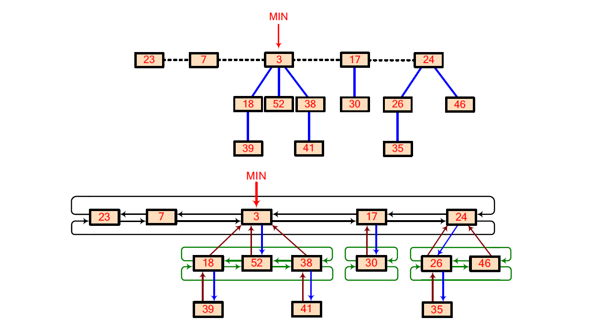

### Operace:

#### `Vlož(↓Prvek)` – O(1)

* Vytvoří se nový samostatný uzel (strom s jedním prvkem).
* Tento uzel se vloží vlevo od **kořene** haldy.
* Pokud má vyšší prioritu než dosavadní maximum, aktualizuje se reference.

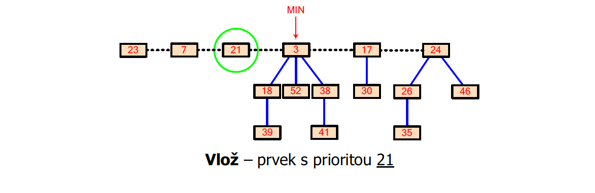

---

#### `Sjednoť(FibH₁, FibH₂)` – O(1)

* Pouhé **spojení seznamů kořenů** ze dvou Fibonacciho hald.
* Aktualizuje se reference na prvek s nejvyšší prioritou.

---

#### `OdeberMax()` – O(log n) (amortizovaně)

#### Fáze 1:

* Najde se **kořen s nejvyšší prioritou**.
* Odebere se ze seznamu kořenů.
* Jeho děti (podstromy) se **vloží mezi ostatní kořeny**.

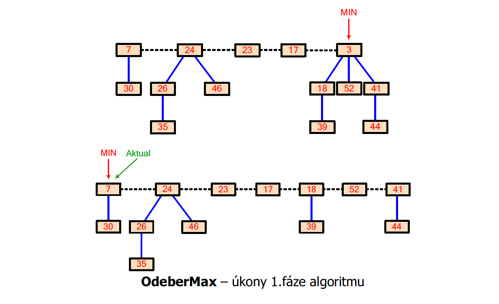

#### Fáze 2: (tzv. konsolidace)

* Spojují se stromy **se stejným stupněm** pomocí operace `Link`.
* Výsledkem je, že z každého řádu zůstane jen jeden strom.

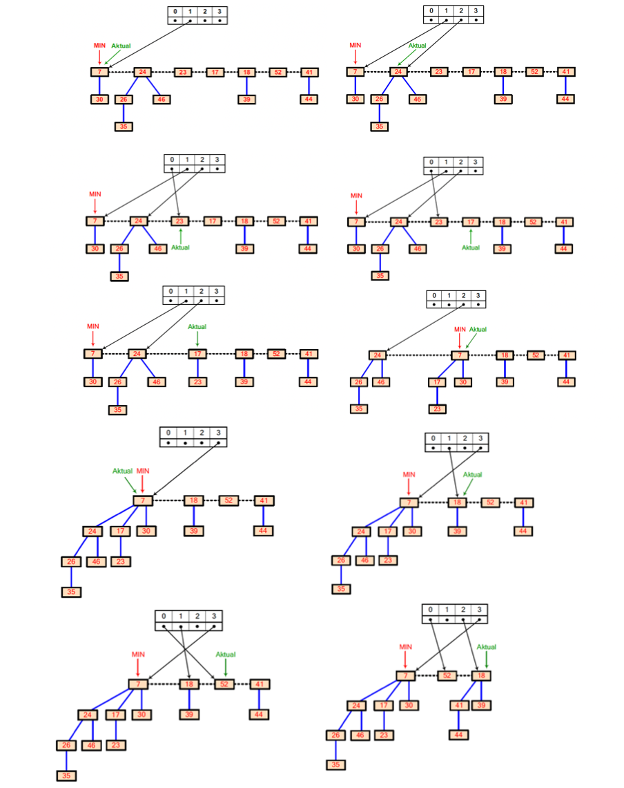

---

#### `ZvyšPrioritu(↓Prvek, ↓NováPriorita)` – O(1) (amortizovaně)

* Zvýší se priorita daného prvku.
* Pokud je nový prvek větší než jeho rodič, provede se **odtržení** a přidání mezi kořeny.
* Pokud jeho rodič už **někoho ztratil dříve**, provede se **rekurzivní odtržení** nahoru.
* Tento mechanismus umožňuje, že složitost je v průměru O(1).

---

#### `Odeber(↓Prvek)` – O(log n)

* Prvek se nejprve pomocí `ZvyšPrioritu` nastaví na extrémní hodnotu (např. ∞).
* Poté se odebere pomocí `OdeberMax()`.
* Tímto způsobem lze odstranit **libovolný prvek**, nejen ten největší.

---

## Párovací halda (Pairing heap)

Jednodušší alternativa k Fibonacciho haldě, implementovaná jako vícecestný strom.

### Vlastnosti:

* Dobré praktické chování (lepší než binomická halda ve většině případů).
* Operace `OdeberMax` vyžaduje dvoufázové slučování podstromů:

  * Nejdřív slučování po dvojicích.
  * Pak zleva doprava znovu sloučení všech vzniklých stromů.

---

## Shrnutí pro zkoušku

🔍 **Obecné principy:**

* Halda je strom s prioritami.
* Operace: `Vlož`, `OdeberMax`, `ZvyšPrioritu`, `Odeber`.

📚 **Implementace:**

* **Binární halda** – rychlá, běžná, vhodná např. pro Dijkstru.
* **Binomická halda** – umožňuje efektivní `Merge`.
* **Fibonacciho halda** – výhodná pro algoritmy s častým slučováním/prioritizací.
* **Pairing heap** – jednodušší verze s dobrým praktickým výkonem.

📘 **Praktický příklad:**

* Umět nakreslit binární haldu z několika čísel (např. 7, 3, 10, 1, 5).
* Umět slovně popsat operaci `OdeberMax` (prosakování dolů).
* U binomické haldy – ukázat slučování dvou hald se stromy B0, B1, B2.
* U Fibonacciho haldy – vědět princip „odřezávání“ a slučování.

✏️ **U zkoušky:**

* **Není třeba znát přesné algoritmy**, ale **umět popsat, jak fungují.**
* Umět říct, **proč použít kterou implementaci**, a **kdy je která výhodná**.

