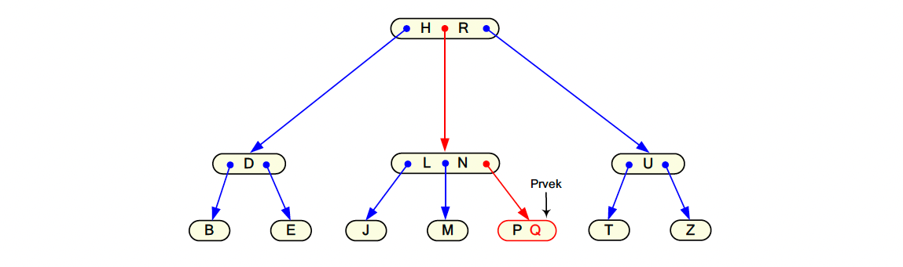
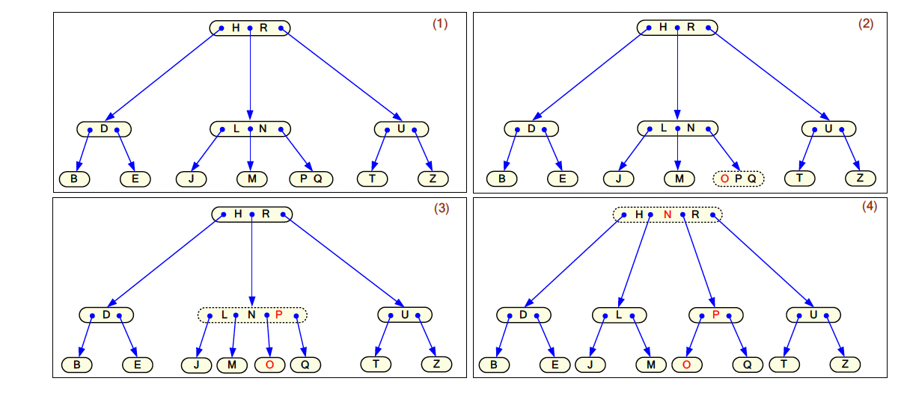
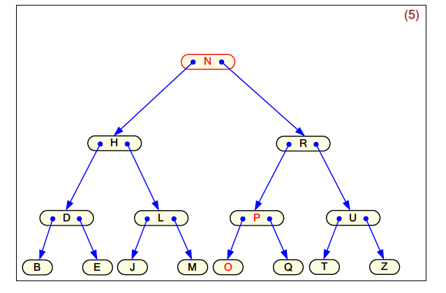
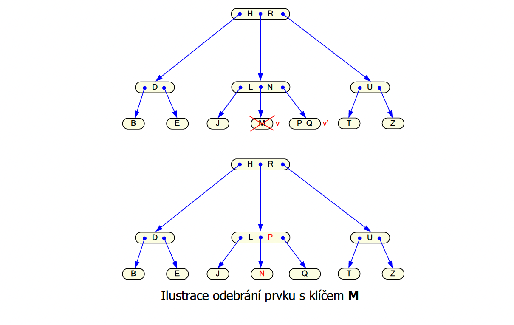
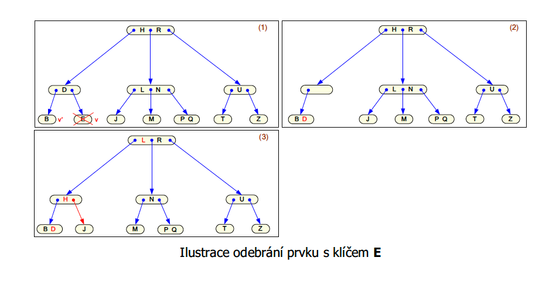
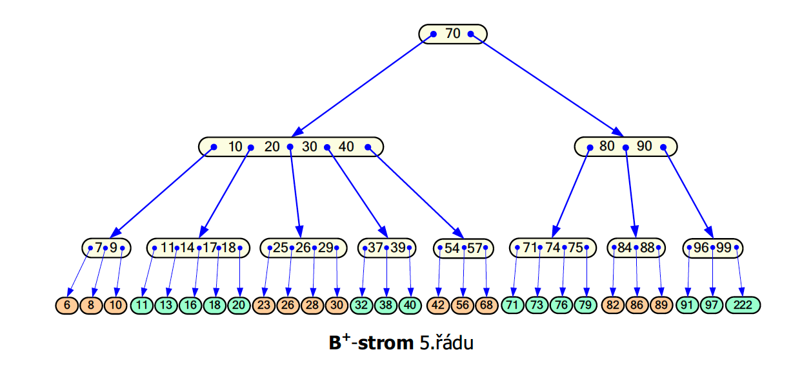
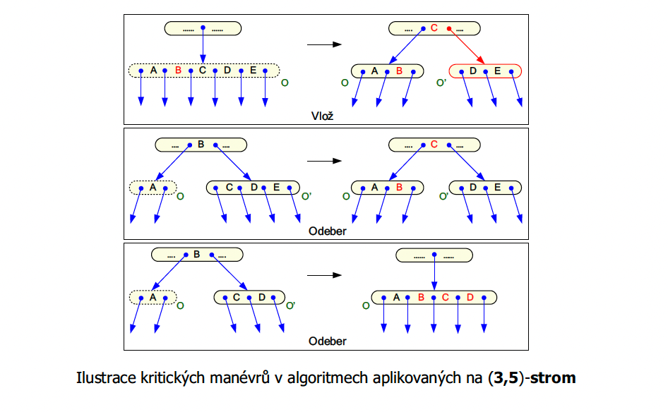

# K-cestné vyhledávací stromy

## Obecný princip

Na rozdíl od binárních stromů, kde každý uzel má max. dva potomky, **K-cestné stromy** umožňují, aby měl uzel **více než dva potomky**. Díky tomu:

* je strom **nižší** (menší hloubka),
* je vhodnější pro **externí paměti** (např. disky), protože při čtení je výhodné načíst celý blok.

### Společné vlastnosti:

* Všechny **listy jsou ve stejné hloubce** (strom je perfektně vyvážený).
* Klíče v každém uzlu **oddělují intervaly** pro potomky (např. klíče `K1`, `K2` oddělují podstromy pro „menší než K1“, „mezi K1 a K2“, „větší než K2“).

---

## 1. 2–3 strom

### Princip:

Každý vnitřní uzel má buď:

* **2 děti a 1 klíč** (2-vrchol), nebo
* **3 děti a 2 klíče** (3-vrchol).

### Vlastnosti:

* Strom je **perfektně vyvážený** – všechny listy mají stejnou hloubku.
* Klíče určují rozsah hodnot pro podstromy (např. `K1 < K2` ⇒ tři podstromy: `< K1`, mezi, `> K2`).

### Operace:

#### `Najdi(↓K, ↓Prvek)` - O(log2 n)

* Procházíme strom podle klíčů a vybíráme správný podstrom – jako u BVS, jen s více větvemi.

#### `Vlož(↓K, ↓Prvek)` - O(log2 n)

1. Najdeme správný list, kam klíč patří.
2. Pokud se list „naplní“ (má už 2 klíče), rozdělíme ho na dva a **střední klíč** posuneme nahoru.
3. Pokud se zaplní i rodič, opět se rozdělí. Může dojít až k **rozdělení kořene** (strom „vyroste“ do výšky).

#### `Odeber(↓K, ↓Prvek)` - O(log2 n)

1. Najdeme prvek a odebereme ho.
2. Pokud by uzel měl méně než 1 klíč, kombinujeme ho s bratrem, nebo si „půjčujeme“ klíč.
3. Může dojít ke slévání i ve vyšších úrovních – **kaskádově**.

---

## 2. (a,b)-strom

### Obecná verze K-cestného stromu:

* Každý uzel má **od `a` do `b` potomků**, kde `2 ≤ a ≤ (b+1)/2`.
* Speciální případ: **2–3 strom = (2,3)-strom**

### Vlastnosti:

* Listy jsou ve stejné hloubce.
* Pokud uzel překročí `b` klíčů – rozdělí se.
* Pokud má po odebrání méně než `a-1` klíčů – slije se s bratrem nebo přerozdělí.

### Výška stromu:

Pro `n` prvků a minimálně `a` potomků má výšku max. `logₐ(n+1)` – tedy **velmi malou výšku i při velkém počtu prvků**.

---

## 3. B-strom

### Definice:

Je to konkrétní případ (a,b)-stromu, kde:

* `b = 2a - 1`
* Uzly se ukládají v **blocích na disku**

### Použití:

* **Souborové systémy**
* **Databázové indexy**

Každý uzel obsahuje více klíčů a ukazatelů – ideální pro čtení větších bloků z disku najednou.

---

## 4. B⁺-strom

### Vylepšený B-strom:

* Všechny **data (záznamy)** se ukládají pouze do **listů**.
* Vnitřní uzly slouží jen jako **indexy**.
* Listy jsou **pospojovány lineárně** (usnadňuje sekvenční procházení).

### Výhody:

* Rychlé **vyhledání rozsahu** (např. všechny prvky mezi 10–50).
* Vhodné pro **databáze a systémy souborů**, kde je potřeba číst sekvence dat.

---

### Operace:

#### `Najdi(↓K, ↓Prvek)`

1. Začneme v kořeni.
2. Najdeme klíč `K`, nebo vybereme mezi dvěma klíči správný podstrom.
3. Pokračujeme tak dlouho, dokud nenarazíme na list nebo nenajdeme hledaný prvek.

#### `Vlož(↓K, ↓Prvek)`

1. Najdeme list, kam `K` patří.
2. Pokud má uzel místo, vložíme.
3. Pokud ne, rozdělíme uzel a posuneme střední klíč nahoru.
4. Tento proces se může opakovat i na úrovni rodičů – až do kořene.

#### `Odeber(↓K, ↓Prvek)` - O(log2 n)

1. Najdeme prvek.
2. Pokud ho odebereme a vznikne nedostatek klíčů (`< a-1`), spojíme se s bratrem, nebo přerozdělíme klíče mezi sousedy.
3. V krajním případě může klesnout výška stromu.

---

## Shrnutí pro zkoušku

🧠 **Principy:**

* K-cestné stromy = stromové struktury s více než dvěma potomky v uzlu. 
* Všechny listy ve stejné hloubce → perfektní vyváženost.

📘 **Základní typy:**

| Typ         | Potomci v uzlu | Klíče v uzlu  | Data v listech  | Indexy | Použití            |
| ----------- | -------------- | ------------- | --------------- | ------ | ------------------ |
| 2–3 strom   | 2 nebo 3       | 1 nebo 2      | Ano             | Ne     | teoretické modely  |
| (a,b)-strom | od a do b      | od a-1 do b-1 | Ano             | Ne     | obecná forma       |
| B-strom     | až 2a–1        | až 2a–2       | Ano             | Ne     | databáze, disky    |
| B⁺-strom    | jako B-strom   | jako B-strom  | Ano (jen listy) | Ano    | indexové struktury |

✏️ **Co umět:**

* Nakreslit malý příklad (např. (3,5)-strom).
* Slovně vysvětlit operace Najdi, Vlož, Odeber.
* Vědět, jaké jsou výhody B⁺-stromu oproti klasickému B-stromu.

