# Vyhledávací stromy

## Základní myšlenka

Vyhledávací strom je struktura, která umožňuje ukládání a efektivní vyhledávání prvků podle klíče. Jednotlivé uzly jsou mezi sebou uspořádány hierarchicky podle pravidel, aby bylo možné rychle určit, kde hledat.

---

## 1. Binární vyhledávací strom (BVS)

### Princip:

Každý uzel má:

* **Klíč**
* **Levý podstrom** – všechny klíče jsou **menší**
* **Pravý podstrom** – všechny klíče jsou **větší**

Tato vlastnost platí rekurzivně pro všechny uzly.

### Operace:

* **Najdi** – postupujeme od kořene, porovnáváme hledaný klíč, jdeme doleva/doprava podle velikosti.
* **Vlož** – hledáme vhodné místo jako při `Najdi`, a nový uzel vložíme jako list.
* **Odeber** – nahrazujeme:

  * list → odebrat rovnou,
  * uzel s jedním potomkem → nahradit potomkem,
  * uzel se dvěma potomky → nahradit „inorder“ následníkem nebo předchůdcem.

### Prohlídky:

* **Inorder (symetrická)** – dává seřazené prvky.
* **Preorder, Postorder** – jiné účely (např. výpis struktury).

### Problém:

* BVS se může stát **nevyváženým** (např. při vkládání vzestupně setříděných čísel), a pak degraduje na **lineární seznam**, tj. pomalý.

---

## 2. AVL stromy

### Princip:

Vyvažovaný binární vyhledávací strom. Pojmenován podle autorů: Adelson-Velskij a Landis.

### Hlavní myšlenka:

* Každý uzel si pamatuje **vyváženost = rozdíl výšek levého a pravého podstromu**.
* Povolená vyváženost: pouze -1, 0 nebo +1.
* Pokud se naruší, strom se **rotuje**.

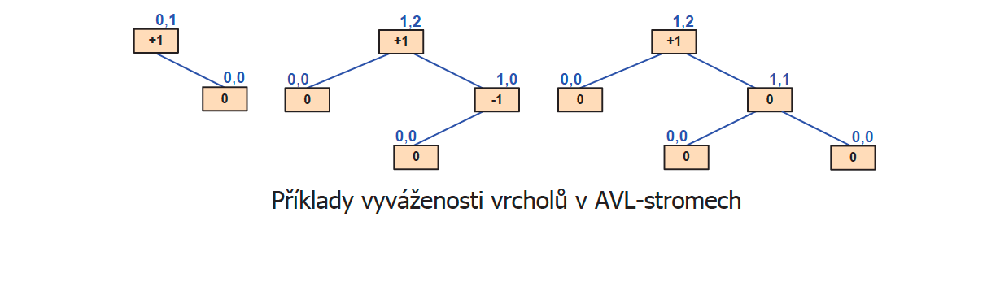

### Rotace:

#### Jednoduchá levá / pravá
* Vytáhne pravého nebo levého syna nahoru

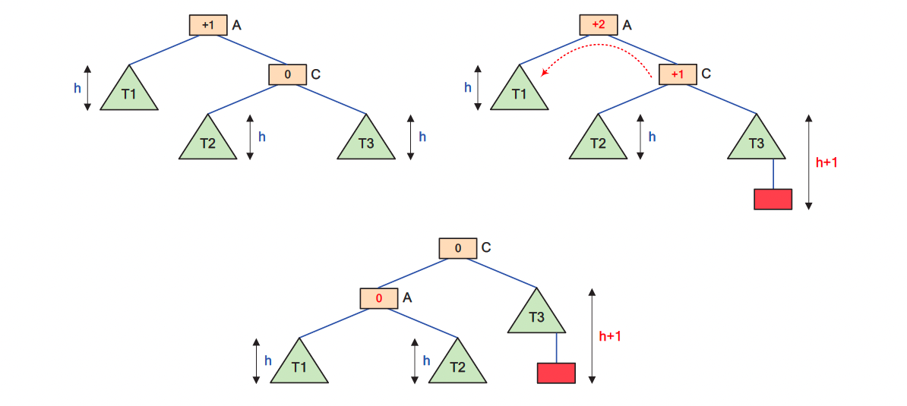

#### Dvojitá pravo-levá / levo-pravá
* Nejprve se provede pravá rotace na pravého potomka, pak levá rotace na kořen

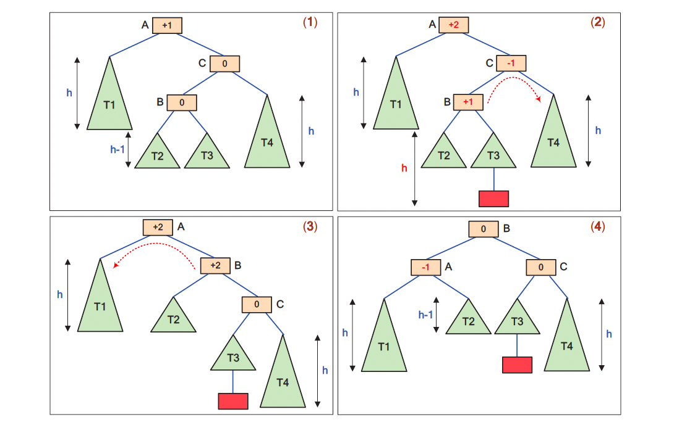

### Operace:

#### `Vlož(↓Klíč, ↓Prvek)` – O(log n)

1. Vložíme nový prvek jako list (jako v BVS).
2. Při návratu směrem ke kořeni kontrolujeme vyváženost.
3. Pokud někde narazíme na rozdíl výšek ±2, provedeme příslušnou rotaci.

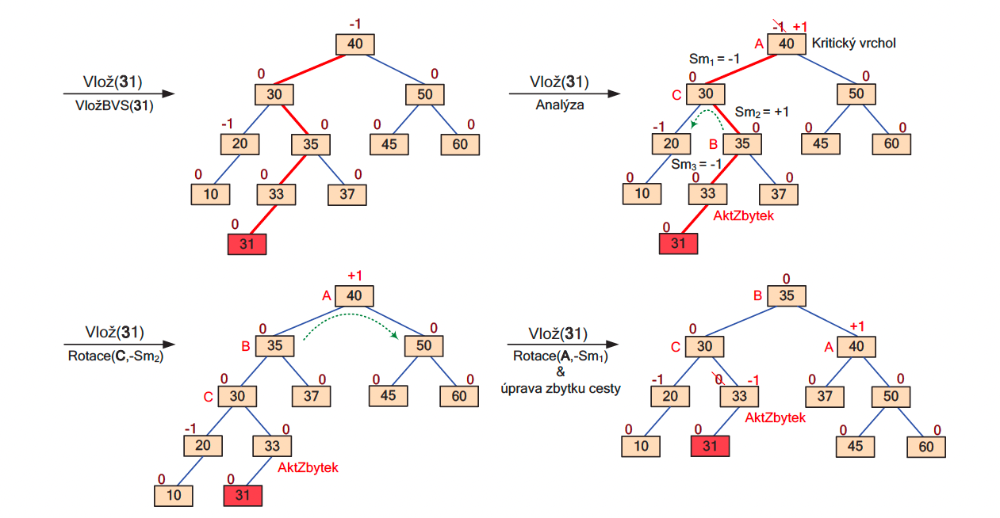

#### `Odeber(↓Klíč, ↓Prvek)` – O(log n)

1. Odebereme jako v BVS.
    * Když je odebíraný **list** - pak je odebrán.
    * Má-li odebíraný prvek pouze **jednoho syna**, pak je jím nahrazen.
    * V ostatních případech je odebíraný vrchol nahrazen příslušným **inorder-následníkem**, který již byl předtím ze stromu odebrán.
2. Zpětně upravujeme vyváženost podél cesty ke kořeni.
3. Pokud je nutné, provedeme rotace (může být víc než jedna – **kaskádovitě**).

---

## 3. Treap (tree + heap)

### Princip:

Kombinuje vlastnosti:

* **BVS** – podle klíče (řazení),
* **Halda (heap)** – podle náhodně vygenerované **priority**.

Díky náhodnosti má treap **pravděpodobnostně vyváženou** strukturu.

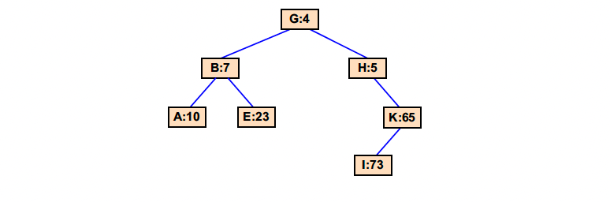

### Vlastnosti:

* Klíče jsou uspořádány jako v BVS.
* Priorita se používá k tomu, aby byla zachována halda – vyšší priorita je „výš“.

### Operace:

#### `Najdi(↓Klíč, ↓Prvek)` – O(log2 n)
* Vyhledávání využívá stejnou strategii jako u BVS

#### `Vlož(↓Klíč, ↓Prvek)` – O(log2 n)

1. Vložíme nový prvek podle BVS pravidla.
2. Přiřadíme náhodnou prioritu
3. Pokud porušíme haldovou vlastnost, rotujeme jako v haldě, abychom prioritu zachovali.

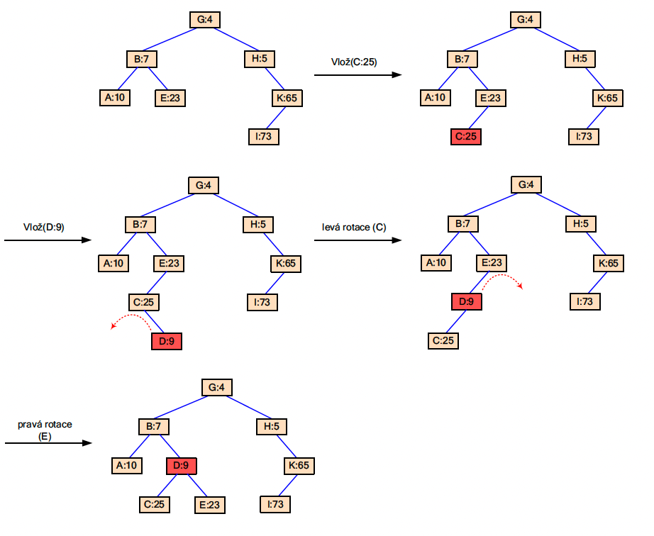

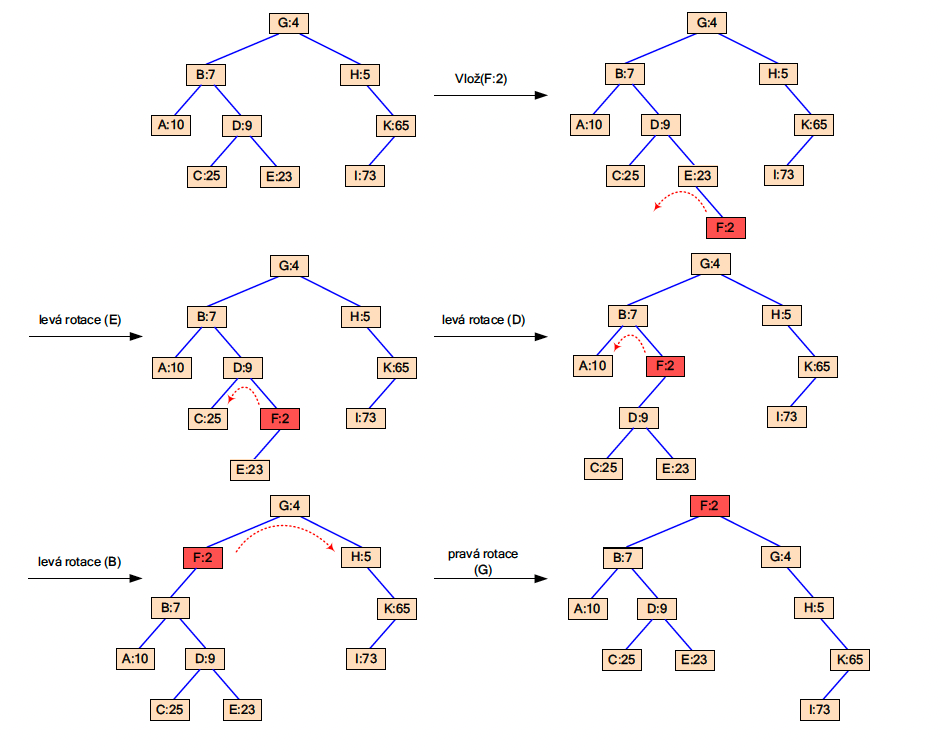

#### `Odeber(↓Klíč, ↓Prvek)` – O(log2 n)

1. Najdeme prvek.
2. Pokud má děti, rotacemi ho „posuneme dolů“, dokud nemá max. jedno dítě.
3. Odstraníme jako list.

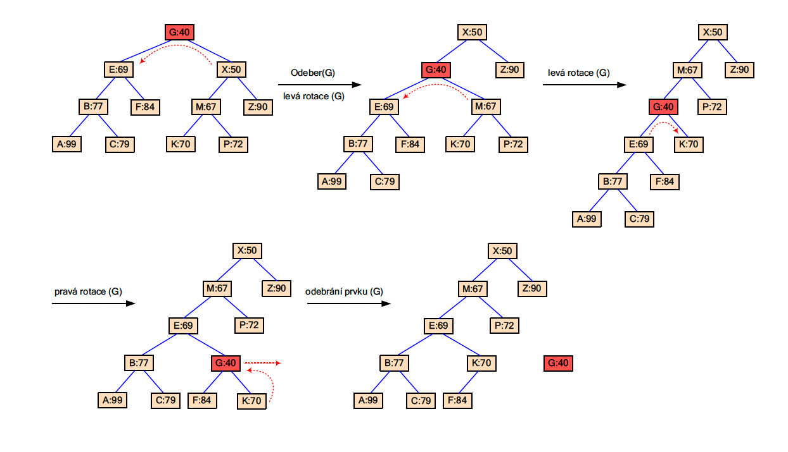

### Výhoda:

* Není potřeba sledovat vyváženosti.
* Díky náhodným prioritám je struktura většinou vyvážená **bez složitého udržování**.

---

## 4. Šikmé stromy (splay tree)

### Princip:

Samoorganizující se BVS, který posouvá naposledy použité prvky na vrchol.

Používá tzv. **heuristiku "move-to-front"**:

* Jakmile nějaký prvek najdeme, rotacemi ho posuneme nahoru (na kořen).

### Operace:

#### `Splay(↓Klíč)` – základní princip
* Po provedení je v kořeni buď:
  * Prvek s klíčem `K` (pokud ve stromu existuje), nebo
  * Inorder-předchůdce/následník (pokud `K` ve stromu není)
* Strom zůstává správným BVS - pouze změní strukturu

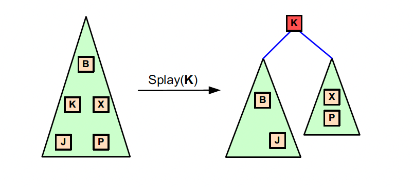

#### `Splay(↓Klíč)` – **move-to-front**
Strategie postupného přemísťování prvků s klíčem `Klíč` až na pozici kořene stromu využívá tří druhů rotací:

* **Cik-cik** – když je prvek a jeho rodič na stejné straně, provedou se **dvě stejné rotace za sebou**
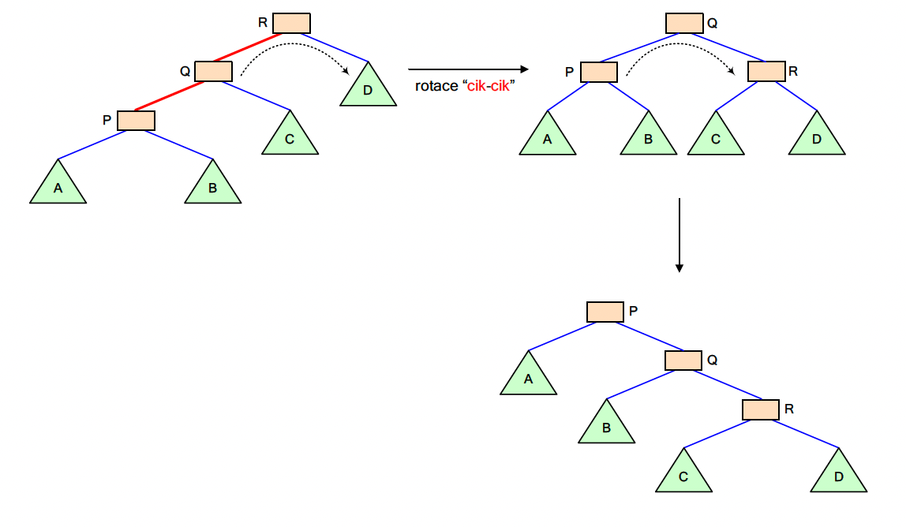
* **Cik-cak** – když jsou na opačné straně, provedou se **dvojité (opačné) rotace**
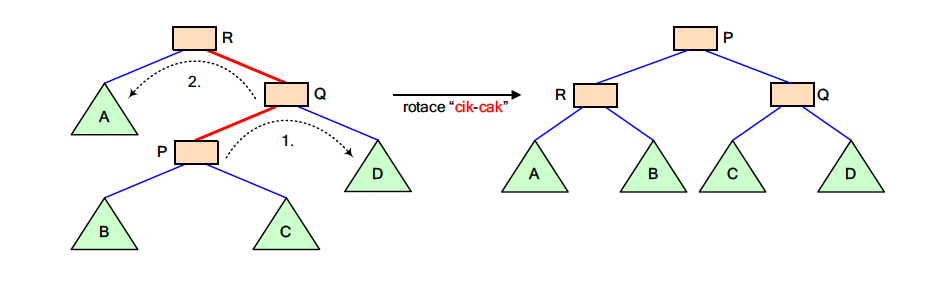
* **Cik** – když je prvek přímo dítě kořene, provede se **jedna rotace**
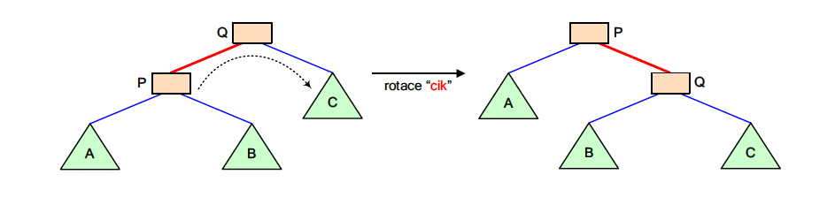

#### `Vlož(↓Klíč, ↓Prvek)`
1. Nejdříve se provede `Splay(klíč)` - přiblíží se pozice pro vložení
2. Vložený prvek se stane novým kořenem
3. Původní strom se rozdělí nalevý a pravý podstrom podle hodnoty a stane se dětmi nového kořene

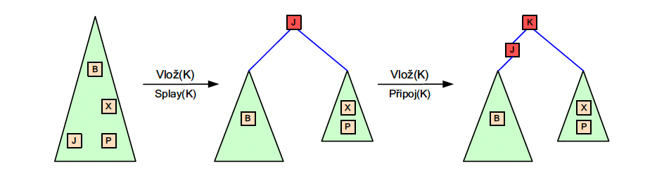

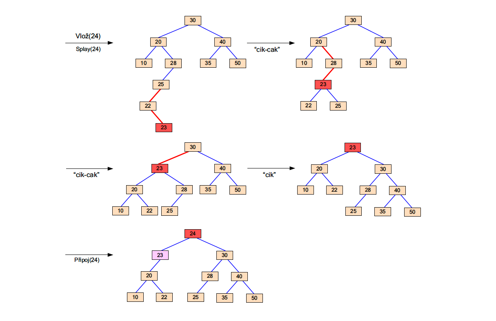

#### `Sjednocení(↓Strom1, ↓Strom2)`
1. Ve `Strom1` se pomocí `Splay(MaxKlíč)` vyhledá největší prvek a přesune se do kořene
2. Pak celý `Strom2` připojí jako pravý podstrom k novému kořeni `Strom1`

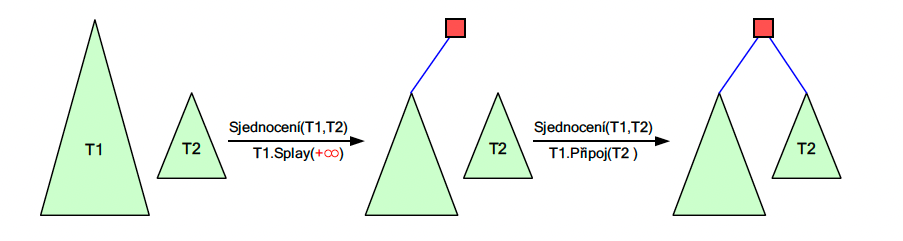

#### `Odeber(↓Klíč, ↓Prvek)`
1. Nejdříve se provede `Splay(klíč)` - prvek se přesune do kořene
2. Prvek se odstraní (kořen)
3. Levý a pravy podstrom se sjednotí pomocí operace `sjednocení`

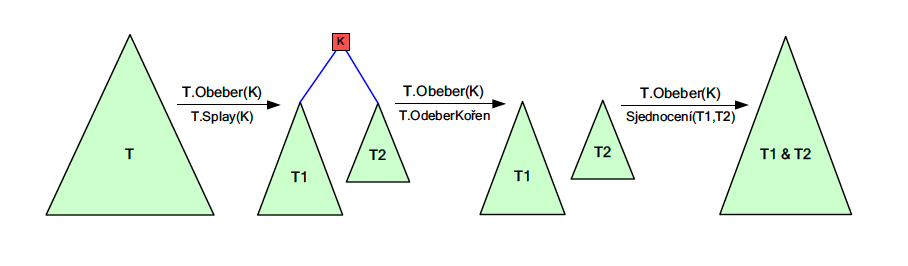

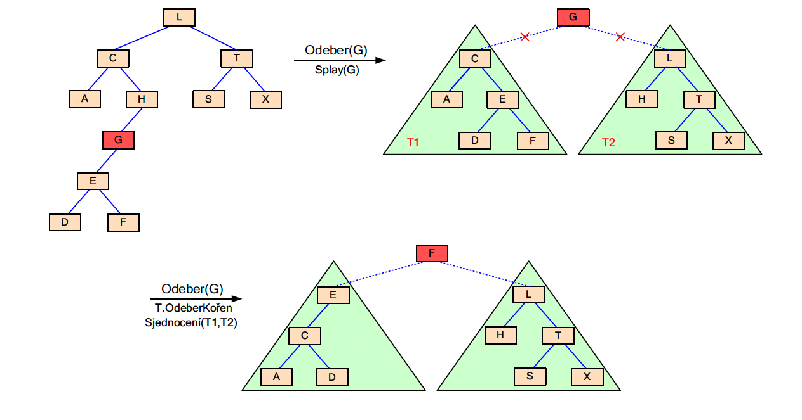

### Výhoda:

* Pokud pracujeme často s několika málo prvky, jsou vždy blízko vrcholu.
* Při velkém množství operací: složitost je **v průměru logaritmická** (amortizovaně O(log n)).

* **Najdi, Vlož, Odeber** – vždy zakončené splay-operací (přesunem prvku na vrchol).

---

## Shrnutí pro zkoušku

✅ **Znát principy jednotlivých stromů**:

| Typ stromu | Hlavní myšlenka                       | Vyváženost     | Výhody                              |
| ---------- | ------------------------------------- | -------------- | ----------------------------------- |
| BVS        | Klíče v levém < uzel < v pravém       | neřeší se      | Jednoduchý, ale může se degenerovat |
| AVL        | Udržuje výškovou rovnováhu            | ±1             | Vždy logaritmická výška             |
| Treap      | BVS podle klíče, halda podle priority | náhodně řízená | Snadná implementace, dobré průměry  |
| Splay      | Posouvá naposledy použitý uzel nahoru | neřeší se      | Efektivní při opakovaném přístupu   |

🧠 **Co umět:**

* Nakreslit příklad každého typu na malé množině čísel.
* Vědět, **jak se liší operace Vlož a Odeber** od běžného BVS.
* Umět slovně popsat rotace (jednoduchá vs. dvojitá).
* Není potřeba znát algoritmy detailně – **jen princip a proč to funguje**.

