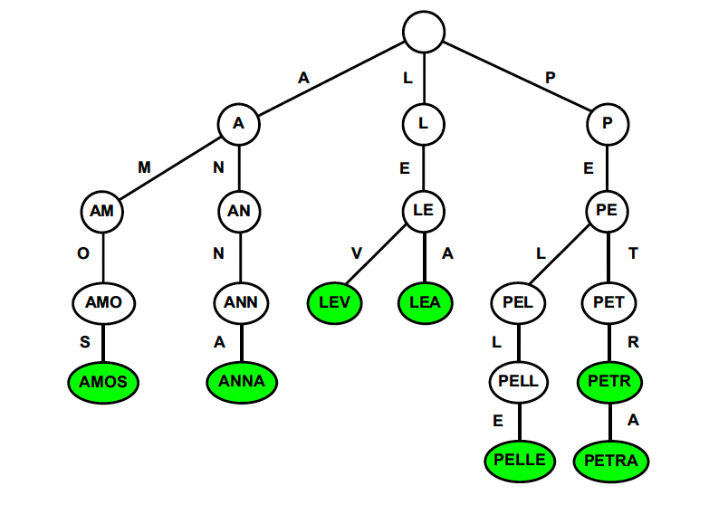
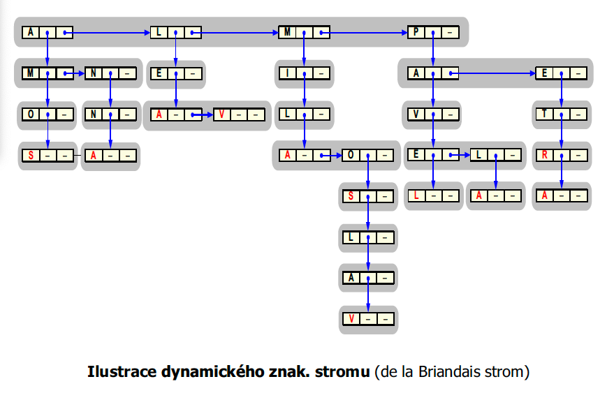

# Trie (znakový strom)

## Jak trie zapadá do kontextu ADT

Trie je specializovaná **stromová datová struktura**, která reprezentuje množinu řetězců (např. slov) a umožňuje jejich efektivní vyhledávání podle znaků. Konceptuálně odpovídá **ADT Tabulka**, kde klíčem je řetězec a hodnotou může být např. počet výskytů, význam slova nebo ukazatel na data.

Ve smyslu **abstraktního datového typu (ADT)** trie realizuje operace jako:

* `Najdi(klíč)`
* `Vlož(klíč)`
* `Odeber(klíč)`
  s tím, že klíčem je vždy celý řetězec.

## Základní princip

Každý uzel trie odpovídá jednomu znaku. Cesta z kořene do listu odpovídá jednomu řetězci. Např. pro slova `AMO`, `AMOS`, `ANNA` vypadá trie takto:

```
A
├── M
│   └── O
│       └── S
└── N
    └── N
        └── A
```

### Vlastnosti:

* Sdílení společných prefixů šetří paměť.
* Umožňuje efektivní vyhledávání, vkládání a odstraňování řetězců.

---

## Implementace trie

### 1. **Pole ukazatelů**

Každý uzel má pole ukazatelů (např. 26 ukazatelů pro písmena A–Z).

```text
Vrchol = array[A..Z] of pointer
```

**Výhody:**

* Rychlý přístup ke konkrétnímu znaku (O(1)).

**Nevýhody:**

* Paměťově náročné – i málo větvené uzly mají celé pole.


---

### 2. **Dynamický seznam (lineární)**

Každý uzel má seznam potomků, kde každý obsahuje znak a ukazatel na další úroveň.

```text
FyzVrchol = record:
  znak
  ukazatel_na_další_vrchol
  ukazatel_na_další_sourozenec
```

**Výhody:**

* Úspora paměti.

**Nevýhody:**

* Hledání mezi potomky je pomalejší než přímý přístup přes pole.


---

## Praktický příklad – malý trie

Mějme slova: `LEA`, `LEV`, `LEALEV`.

Trie bude vypadat takto:

```
L
└── E
    ├── A
    │   └── L
    │       └── E
    │           └── V
    └── V
```

Z toho plyne:

* `LEA` končí po `A`
* `LEV` je druhá větev z `E`
* `LEALEV` pokračuje dál za `A`

---

## Trie a složitost

* Operace `Najdi`, `Vlož`, `Odeber` mají časovou složitost **O(d)**, kde `d` je délka hledaného řetězce.
* Nezáleží na počtu slov v trie, ale na délce hledaného slova.

---

## De la Briandaisův strom

Tato varianta trie:

* Umožňuje úspornější reprezentaci s použitím ukazatelů na **sourozence a syna**.
* Heuristiky:

  * **Move-to-front**: často používané znaky se posouvají na začátek seznamu.
  * **Transpose**: hledaný znak se vymění s předchozím – vhodné, pokud mají znaky podobné frekvence.

Používá se tam, kde záleží na optimalizaci paměti a hledání často opakovaných slov.

---

## Shrnutí pro zkoušku

🔍 **Vysvětlit princip:**

* Každý uzel trie odpovídá jednomu znaku.
* Celé slovo je reprezentováno cestou od kořene ke konci.

🧱 **Popiš základní implementace:**

* Pole ukazatelů – rychlé, paměťově náročné.
* Dynamický seznam – úsporný, pomalejší.

📝 **Praktický příklad:**

* Vybuduj trie pro 3–5 slov.
* Stačí umět zakreslit základní větvení.

🧠 **Pamatuj si pro zkoušku:**

* `Najdi`, `Vlož`, `Odeber` – složitost O(d)
* De la Briandais strom + heuristiky
* Není třeba znát algoritmus, ale **vědět princip a typy implementací**

