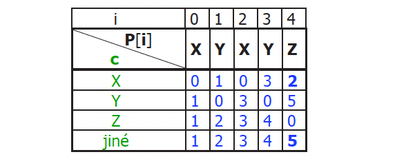
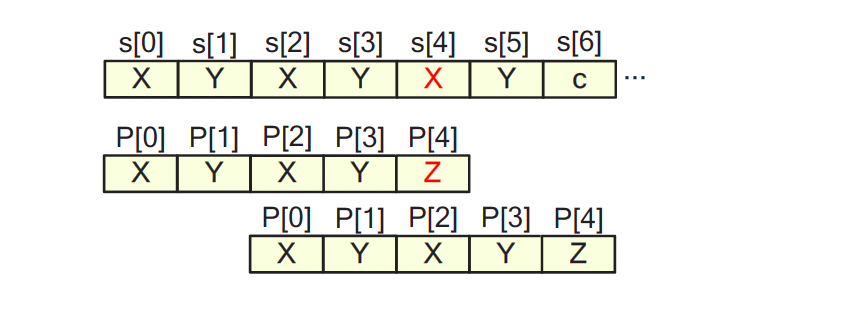

# Řetězce a jejich zpracování

## Co je to řetězec?

Řetězec je posloupnost znaků z určité abecedy (např. česká nebo anglická písmena). Můžeme si ho představit jako řadu písmen, podobně jako slovo nebo věta.

Formálně je řetězec pole prvků (např. `s[0] = 'A'`, `s[1] = 'h'`, …), přičemž každý prvek musí být znakem z definované množiny M, kterou nazýváme abeceda.

* **Prázdný řetězec** je řetězec bez znaků.
* **Délka řetězce** je počet znaků, které obsahuje.

Např. pro množinu `M = {A, B, C}`, může být řetězec `s = [A, B, B, C]`.

---

## Jak se řetězce ukládají?

Ve vyšších programovacích jazycích se pro práci s řetězci používají datové typy jako `string`. Ty využívají pevné kódy pro jednotlivé znaky – například ASCII nebo Unicode.

Pokud potřebujeme pracovat s velmi dlouhými texty (například knihy), je výhodné je **komprimovat**, abychom ušetřili místo v paměti. Komprimace využívá toho, že některé znaky (např. mezera) se vyskytují častěji než jiné (např. `q`).

---

## Kódování textů

Cílem kódování je převést text do podoby, která zabírá méně místa. Využívají se přitom různé algoritmy.

### Huffmanovo kódování

**Princip:** Čím častěji se znak v textu vyskytuje, tím kratší kód dostane.

#### Vlastnosti:

* Každý znak má unikátní kód.
* Žádný kód není předponou jiného (např. `101` není začátek jiného platného kódu).
* Kódy se reprezentují pomocí binárního stromu. Cesta z kořene do listu představuje kód znaku (např. 0 = vlevo, 1 = vpravo).

#### Popis kódovacího algoritmu

1. Seřaď všechny uzly podle četnosti (vzestupně).
2. Spoj dva uzly s nejnižší četností do nového uzlu (jejich frekvence se sčítají).
3. Tento nový uzel se považuje za „sloučený znak“ a vrací se zpět do seznamu uzlů.
4. Opakuj, dokud nezůstane jediný uzel – to je kořen stromu.

#### Popis dekódovacího algoritmu:

1. Začneme v kořeni stromu.
2. Pro každý bit ve vstupním kódu:

   * Pokud je to `0`, jdeme doleva.
   * Pokud je to `1`, jdeme doprava.
3. Jakmile narazíme na list, máme znak.
4. Výstupem je znak a pokračujeme znovu od kořene.

#### Typy Huffmanova kódování:

* **Statické** – jeden strom pro všechny texty stejného typu (např. všechny české knihy).
* **Adaptivní** – strom se průběžně mění podle toho, co bylo zatím přečteno.

#### Příklad
Kódování ilustračního textu:
> ’mame kokosy a ananasy a mandarinky’


---

### Lempel-Zivovo kódování (LZ)

**Princip:** Místo jednotlivých znaků se kódují celé sekvence znaků, které se v textu opakují.
> Místo toho, abychom opakovaný řetězec psali znovu, jen si zapamatujeme, že už jsme ho jednou použili, a příště ho odkážeme číslem.

LZ-kódování je postavené na `Hashovací tabulce`
Pro implementaci (dynamického) slovníku lze využít **Znakový strom (Trie)**

#### Jak to funguje:

1. Na začátku má algoritmus slovník obsahující jednotlivé znaky.
2. Hledá nejdelší sekvenci znaků, kterou už ve slovníku má.
3. Tuto sekvenci zakóduje číslem (kódem) ze slovníku.
4. Přidá novou sekvenci do slovníku.
5. Postupuje dál v textu.

#### Výhody:

* Efektivní pro texty, kde se často opakují slova nebo části slov.

#### Problémy:

* Slovník se může „zaplnit“ – je nutné buď přestat přidávat nové položky, nebo něco ze slovníku odebrat.

#### Příklad
>LZ-kódování textu `ananas` po provedené inicializaci slovníku

```json
1: (0, a) → "a"      | "ananas"
2: (0, n) → "n"      | "nanas"
3: (1, n) → "an"     | "anas"
4: (2, a) → "na"     | "nas"
5: (1, s) → "as"     | "as"  
6: (0, s) → "s"      | "s"  

```

#### Popis algoritmu kroku 4:
* Vstupní řetězec: `"nas"`
* Hledáme nejdelší prefix řetězce ve slovníku → `n → index 2`
* Další znak, který následuje: `a`
* Výstup do slovníku: `(2, a) → "na"`
* Vstup zkrátíme o prefix `n`
* Nový vstupní řetězec: `"as"`

---

#### Příklad komprese slova `ananas` pomocí LZW


## Vyhledávání v řetězcích

### Přímé vyhledávání

**Princip:** Porovnává se každý možný výskyt vzoru ve větším textu.

#### Slovní popis algoritmu:

1. Pro každý možný začátek ve větším textu:

   * Porovnávej znak po znaku, zda se vzor (např. `ABCD`) shoduje s částí textu (např. `ABCE`).
   * Pokud se všechny znaky shodují, vzor byl nalezen.

#### Výhoda:

* Jednoduchý algoritmus.

#### Nevýhoda:

* Neefektivní pro delší texty nebo složité vzory.


#### Akceptovatelné pro:
* Kratší texty
* Krátké vzory
* Čtení z externí paměti
---

### Knuth-Morris-Pratt (KMP) algoritmus

**Princip:** Při neúspěchu neporovnává zbytečně znaky znovu – pamatuje si, co už bylo porovnáno.

#### Slovní popis:

1. Algoritmus si připraví tabulku posunů podle vzoru (tzv. `kmpPole`).
2. Při neshodě nevrací hledání úplně zpět, ale posune vzor o optimální počet znaků.
3. Díky tomu je mnohem rychlejší než přímé vyhledávání.

#### Příklad:
* Pokud `kmpPole[4][X] = 2` posuneme pattern o 2 znaky doprava




#### Pravidla výpočtu `kmpPole[i][c]`
Chceme najít nejmenší `d`, že
1. `P[i - d] == c`
2. `P[j] == P[j + d]` pro všechna `j = 0 .. i - d - 1`

Pokud žádné `d` nevyhovuje (jiné), pak nastavíme `d = i + 1` 

---

### Stavový automat

**Princip:** Vzor se převede na „automat“, který postupně prochází text a sleduje, jestli došel do „cílového stavu“ (tedy že byl vzor nalezen).

#### Slovní popis:

1. Vytvoříme tabulku přechodů (stavů).
2. Pro každý nový znak ve vstupu přecházíme do nového stavu.
3. Pokud se dostaneme do finálního stavu, znamená to, že jsme vzor našli.


---

### Další algoritmy (stručně)

* **Boyer-Moore:** Vyhledává vzor zprava doleva, často efektivnější než KMP.
* **Karp-Rabin:** Používá matematickou funkci (tzv. otisk – „hash“) k rychlému vyhledávání. Vhodné pro velmi dlouhé texty.

